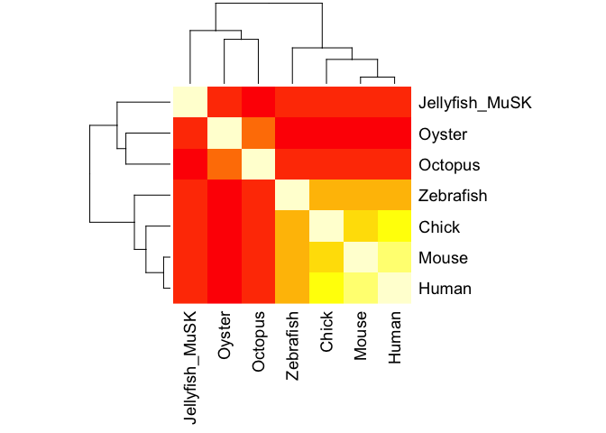

Find-a-gene Project
================

Generating the identity heatmap of multiple sequence alignment for MuSK family.
-------------------------------------------------------------------------------

Calculating the identity matrix

``` r
library(bio3d)
seq.aln <- read.fasta("Seqalignment_MuSK.fasta")
seq.ide <- seqidentity(seq.aln)
```

Plot identity matrix in heatmap form

``` r
heatmap(seq.ide, symm = TRUE, labRow = seq.aln$id, labCol = seq.aln$id, margins = c(9,7.5))
```



Search the main protein structure database for the most similar atomic resolution structures to your aligned sequences.
-----------------------------------------------------------------------------------------------------------------------

Generating consensus sequence from the alignment

``` r
seq.conss <- consensus(seq.aln)
```

Since the consensus sequence might have a lot of gaps due to Jellyfish MuSK is quite distant from some other organisms, human MuSK (the row-wise maximum identity to other sequences used in alignment) will be used to search for similar atomic resolution structures.

``` r
seq4pdb <- read.fasta("data/Sequence_for_PDB_search.txt")
pdbhits <- blast.pdb(seq4pdb)
```

    ##  Searching ... please wait (updates every 5 seconds) RID = 8H14E4W101R 
    ##  .
    ##  Reporting 100 hits

Add annotation to the pdbhits result

``` r
pdbhits.anno <- pdb.annotate(substr(pdbhits$hit.tbl$pdb.id, 1,4), anno.terms = c("structureId", "experimentalTechnique", "resolution", "source"), unique = TRUE)
pdbhits.report <- data.frame(pdbhits.anno, pdbhits$hit.tbl$evalue, pdbhits$hit.tbl$identity)
colnames(pdbhits.report) <- c("Id", "Technique", "Resolution", "Source", "Evalue", "Identity")
print.data.frame(pdbhits.report[1:3,], row.names = FALSE)
```

    ##    Id         Technique Resolution            Source   Evalue Identity
    ##  1LUF X-RAY DIFFRACTION       2.05 Rattus norvegicus 3.69e-77   46.094
    ##  4YNE X-RAY DIFFRACTION       2.02      Homo sapiens 2.07e-75   44.672
    ##  5I8A X-RAY DIFFRACTION       2.33      Homo sapiens 2.31e-75   44.672
