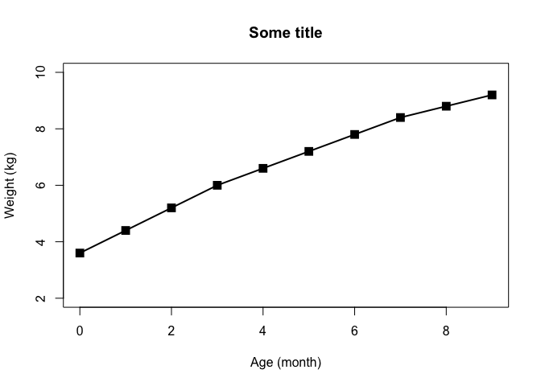
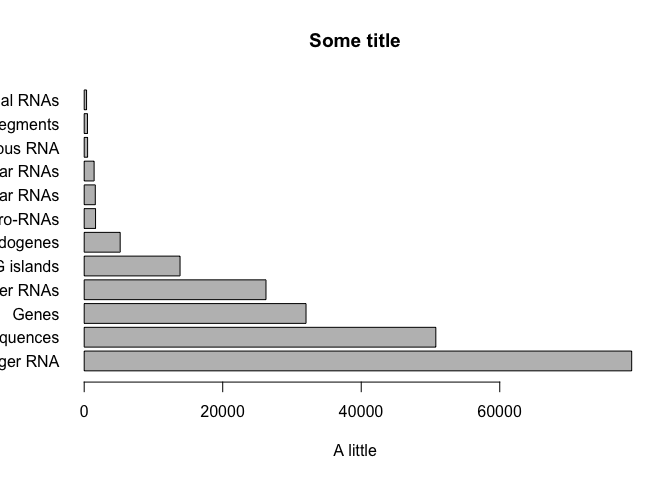
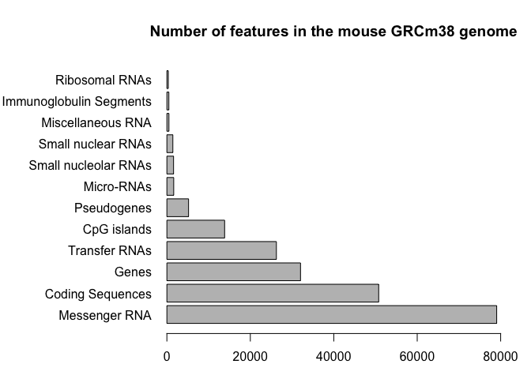
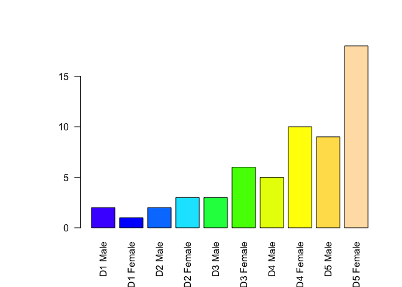
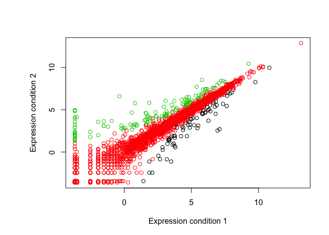
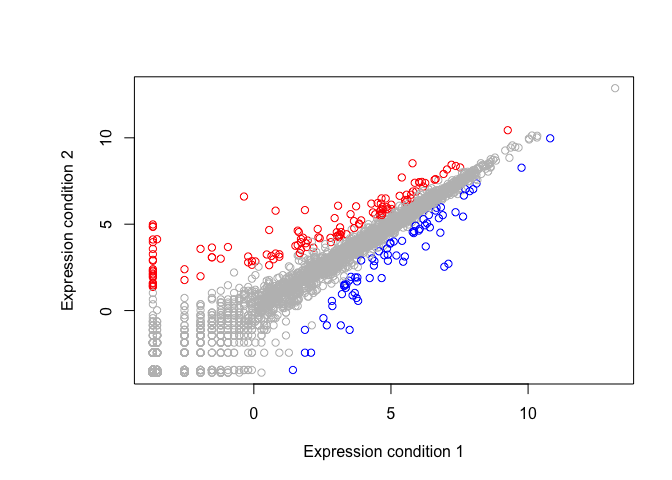

Crop Analysis Q3 2013
================
John Smith
May 3rd, 2014

``` r
# Class 05 Graphics and Plots with R

# Section 2A: Line plot

weight <- read.table("bimm143_05_rstats/weight_chart.txt", header = TRUE)

plot(weight$Age, weight$Weight, type = "o", pch = 15, cex = 1.5, lwd = 2, ylim = c(2,10), xlab = "Age (month)", ylab = "Weight (kg)", main = "Some title")
```



``` r
# Section 2B: Bar plot

feature <- read.table("bimm143_05_rstats/feature_counts.txt", header = TRUE, sep = "\t") 
# sep: delimiter, google for the standard symbol of different deimiters

barplot(feature$Count, names.arg = feature$Feature, las = 1, horiz = TRUE, xlab = "A little", main = "Some title") 
```



``` r
# names.arg: to assign observations for each bar, and las to rotate the observations' strings for visualization

# to look up possible parameters, use ?par. To change parameters, in this example, use par()$mar. Then set the margin to accommodate the graph with the following:
par(mar= c(3, 11, 4, 2))

barplot(feature$Count, names.arg = feature$Feature, las = 1, horiz = TRUE, main = "Number of features in the mouse GRCm38 genome", xlim = c(0,80000))
```



``` r
# Section 3A

mf <- read.table("bimm143_05_rstats/male_female_counts.txt", header = TRUE, sep = "\t")

par(mar = c(5, 7, 4, 2))

barplot(mf$Count, names.arg = mf$Sample, las = 2, col = topo.colors(nrow(mf)))
```



``` r
# Section 3B

genes <- read.delim("bimm143_05_rstats/up_down_expression.txt")

nrow(genes)
```

    ## [1] 5196

``` r
table(genes$State)
```

    ## 
    ##       down unchanging         up 
    ##         72       4997        127

``` r
plot(genes$Condition1, genes$Condition2, type = "p", xlab = "Expression condition 1", ylab = "Expression condition 2", col=genes$State)
```



``` r
levels(genes$State)
```

    ## [1] "down"       "unchanging" "up"

``` r
palette(c("blue", "gray", "red"))

plot(genes$Condition1, genes$Condition2, type = "p", xlab = "Expression condition 1", ylab = "Expression condition 2", col=genes$State)
```


