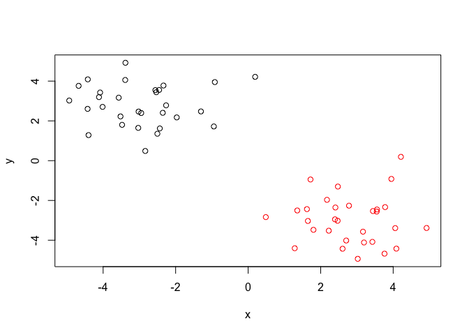

Machine Learning
================
Tuan
2/6/2019

R Markdown
----------

k-means clustering

``` r
tmp <- c(rnorm(30,-3), rnorm(30,3))
x <- cbind(x=tmp, y=rev(tmp))
plot(x)
```


``` r
km <- kmeans(x, centers = 2, nstart = 20)
km
```

    ## K-means clustering with 2 clusters of sizes 30, 30
    ## 
    ## Cluster means:
    ##           x         y
    ## 1 -2.954822  2.808939
    ## 2  2.808939 -2.954822
    ## 
    ## Clustering vector:
    ##  [1] 1 1 1 1 1 1 1 1 1 1 1 1 1 1 1 1 1 1 1 1 1 1 1 1 1 1 1 1 1 1 2 2 2 2 2
    ## [36] 2 2 2 2 2 2 2 2 2 2 2 2 2 2 2 2 2 2 2 2 2 2 2 2 2
    ## 
    ## Within cluster sum of squares by cluster:
    ## [1] 73.60458 73.60458
    ##  (between_SS / total_SS =  87.1 %)
    ## 
    ## Available components:
    ## 
    ## [1] "cluster"      "centers"      "totss"        "withinss"    
    ## [5] "tot.withinss" "betweenss"    "size"         "iter"        
    ## [9] "ifault"

In the result: *Clustering vector*: a vector shows which element of data belongs to which cluster

Size of cluster

``` r
km$size
```

    ## [1] 30 30

Cluster membership vector

``` r
km$cluster
```

    ##  [1] 1 1 1 1 1 1 1 1 1 1 1 1 1 1 1 1 1 1 1 1 1 1 1 1 1 1 1 1 1 1 2 2 2 2 2
    ## [36] 2 2 2 2 2 2 2 2 2 2 2 2 2 2 2 2 2 2 2 2 2 2 2 2 2

``` r
plot(x, col = km$cluster)
points(km$centers, col = "blue", pch = 15, cex = 1.5)
```


``` r
# First we need to calculate point (dis)similarity
#   as the Euclidean distance between observations
dist_matrix <- dist(x)
# The hclust() function returns a hierarchical
#  clustering model
hc <- hclust(d = dist_matrix)
# the print method is not so useful here
hc
```

    ## 
    ## Call:
    ## hclust(d = dist_matrix)
    ## 
    ## Cluster method   : complete 
    ## Distance         : euclidean 
    ## Number of objects: 60

``` r
# The equivalent in one single line: hclust(dist(x))
```

``` r
plot(hc)
abline(h = 6, col = "red")
```


``` r
grp2 <- cutree(hc, h = 6)
```

``` r
plot(x, col = grp2)
```



``` r
plot(hc)
abline(h = 6, col = "red")
```


``` r
grp6 <- cutree(hc, h = 2.5)
table(grp6)
```

    ## grp6
    ##  1  2  3  4  5  6  7  8  9 10 11 12 
    ##  8  5  7  6  2  2  8  5  2  7  6  2

We can also use k = groups to cut tree

``` r
cutree(hc, k = 3)
```

    ##  [1] 1 1 1 1 1 1 1 1 1 1 1 1 1 1 1 1 1 1 1 1 1 1 1 1 1 1 1 1 1 1 2 2 3 2 2
    ## [36] 2 2 3 2 2 2 2 2 2 2 2 2 2 3 3 2 2 2 2 2 2 2 2 2 2

### Using different Linkage methods of HC

``` r
d <- dist_matrix
hc.complete <- hclust(d, method="complete")
plot(hc.complete)
```


``` r
hc.average  <- hclust(d, method="average")
plot(hc.average)
```


``` r
hc.single   <- hclust(d, method="single")
plot(hc.single)
```

 Made up overlapping data - a bit more real lfe like

``` r
# Step 1. Generate some example data for clustering
x2 <- rbind(
  matrix(rnorm(100, mean=0, sd = 0.3), ncol = 2),   # c1
  matrix(rnorm(100, mean = 1, sd = 0.3), ncol = 2), # c2
  matrix(c(rnorm(50, mean = 1, sd = 0.3),           # c3
           rnorm(50, mean = 0, sd = 0.3)), ncol = 2))
colnames(x2) <- c("x", "y")
# Step 2. Plot the data without clustering
plot(x2)
```


``` r
# Step 3. Generate colors for known clusters
#         (just so we can compare to hclust results)
col <- as.factor( rep(c("c1","c2","c3"), each=50) )
plot(x2, col=col)
```


``` r
# Use the dist(), hclust(), plot(), cutree(). Hierarchical clustering goes through 3 main steps: distance matrix, hclust, and plot.
dist_matrix2 <- dist(x2)
hclust2 <- hclust(dist_matrix2)
groups3 <- cutree(hclust2, k = 3)
plot(hclust2)
```


``` r
plot(x2, col = groups3)
```


``` r
# Each run of clustering will have slightly different colored graph due to random assignment at the beginning of the algorithm.
```

Principal component analysis (PCA)
==================================

``` r
mydata <- read.csv("https://tinyurl.com/expression-CSV",
row.names=1)
head(mydata)
```

    ##        wt1 wt2  wt3  wt4 wt5 ko1 ko2 ko3 ko4 ko5
    ## gene1  439 458  408  429 420  90  88  86  90  93
    ## gene2  219 200  204  210 187 427 423 434 433 426
    ## gene3 1006 989 1030 1017 973 252 237 238 226 210
    ## gene4  783 792  829  856 760 849 856 835 885 894
    ## gene5  181 249  204  244 225 277 305 272 270 279
    ## gene6  460 502  491  491 493 612 594 577 618 638

**NOTE**: **prcomp()** expects the samples to be rows and genes to be columns so we need to first transpose the matrix with the **t()** function!

``` r
pca <- prcomp(t(mydata), scale = T)
summary (pca)
```

    ## Importance of components:
    ##                           PC1    PC2     PC3     PC4     PC5     PC6
    ## Standard deviation     9.6237 1.5198 1.05787 1.05203 0.88062 0.82545
    ## Proportion of Variance 0.9262 0.0231 0.01119 0.01107 0.00775 0.00681
    ## Cumulative Proportion  0.9262 0.9493 0.96045 0.97152 0.97928 0.98609
    ##                            PC7     PC8     PC9      PC10
    ## Standard deviation     0.80111 0.62065 0.60342 3.348e-15
    ## Proportion of Variance 0.00642 0.00385 0.00364 0.000e+00
    ## Cumulative Proportion  0.99251 0.99636 1.00000 1.000e+00

Make our first PCA plot

``` r
plot(pca$x[, 1], pca$x[, 2], xlab = "PC1", ylab = "PC2")
```


``` r
## Precent variance is often more informative to look at
pca.var <- pca$sdev^2
pca.var.per <- round(pca.var/sum(pca.var)*100, 1)
 barplot(pca.var.per, main="Scree Plot",
 xlab="Principal Component", ylab="Percent Variation")
```


``` r
## A vector of colors for wt and ko samples
 colvec <- as.factor( substr( colnames(mydata), 1, 2) )
#substr(x, start, stop): take a string a trim it down from start to stop
plot(pca$x[,1], pca$x[,2], col=colvec, pch=16,
xlab=paste0("PC1 (", pca.var.per[1], "%)"),
ylab=paste0("PC2 (", pca.var.per[2], "%)"))
```


``` r
UK.food <- read.csv("https://bioboot.github.io/bggn213_f17/class-material/UK_foods.csv", row.names = 1)
head(UK.food)
```

    ##                England Wales Scotland N.Ireland
    ## Cheese             105   103      103        66
    ## Carcass_meat       245   227      242       267
    ## Other_meat         685   803      750       586
    ## Fish               147   160      122        93
    ## Fats_and_oils      193   235      184       209
    ## Sugars             156   175      147       139

``` r
UK.food.pca <- prcomp(t(UK.food))
plot(UK.food.pca$x[,1], UK.food.pca$x[,2], xlab = "PC1", ylab = "PC2")
text(UK.food.pca$x[,1], UK.food.pca$x[,2], colnames(UK.food), col = c("orange", "red", "blue", "dark green"))
```


``` r
## Lets focus on PC1 as it accounts for > 90% of variance 
par(mar=c(10, 3, 0.35, 0))
barplot( UK.food.pca$rotation[,1], las=2 )
```


